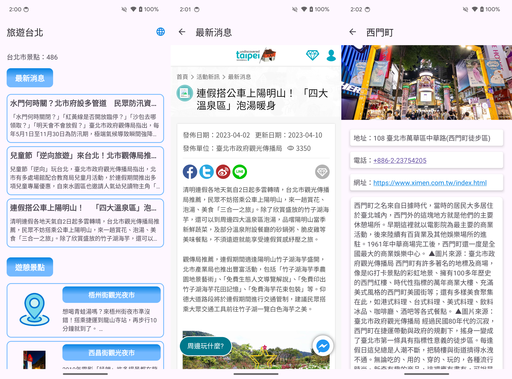
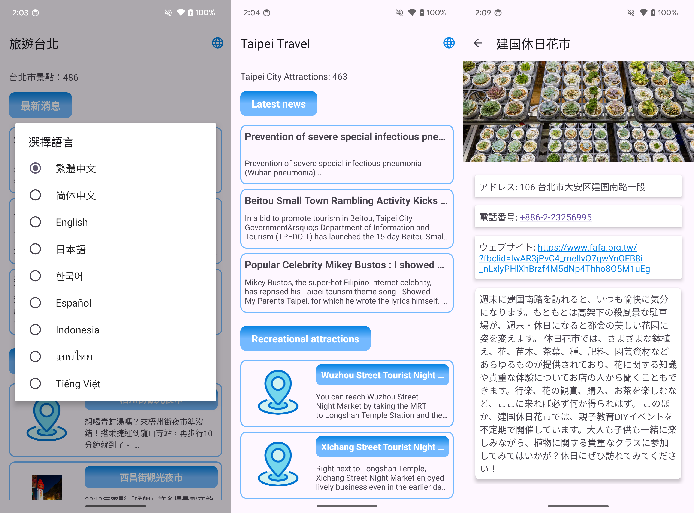

# CathayTravel - 旅遊台北

### 專案截圖
  



---

### 使用技術
- Kotlin
- MVVM
- DI - Hilt
- Retrofit + OkHttp
- Gson
- Coroutine
- Flow
- Coil - 處理圖片顯示

### 專案成果
- Kotlin + MVVM 架構
- 介接旅遊資訊 [API](https://www.travel.taipei/open-api/swagger/ui/index#/)
- 顯示最新消息、旅遊景點 列表
- 顯示景點內容(基本資訊)，支援景點所有照片左右滑動瀏覽
- 最新消息、景點官網可在 App 內瀏覽網頁，且 WebView 支援手機返回鍵回到上一個網頁
- 多國語言切換，API 請求參數也一併切換，包括：繁中、簡中、英文、日文、韓文、西班牙文、印尼文、泰文、越南文)
- 手機轉向、Dark Mode 資料不丟失

### 專案分層

``` Kotlin
CathayTravel/app/src/main/java/com/cathay/travel
├── App.kt
├── Constants.kt
├── di/
│   └── AppModule.kt
├── extension/
│   └── ComponentExt.kt
├── model
│   ├── Event.kt
│   ├── EventObserver.kt
│   ├── Resource.kt
│   ├── lang/
│   ├── news/
│   └── place/
├── network
│   └── TravelTaipeiApi.kt
├── repository
│   ├── ITravelRepository.kt
│   └── TravelRepository.kt
├── ui
│   ├── home/
│   ├── news/
│   ├── place/
│   └── web/
└── utils
    ├── LanguageUtil.kt
    └── SharedPreferenceUtil.kt
```  
#### Home (首頁)

``` Kotlin
home/
├── HomeActivity.kt
├── HomeFragment.kt
├── HomeViewModel.kt
└── adapter
    ├── NewsAdapter.kt
    └── PlaceAdapter.kt
```

#### Place (景點內容頁)

``` Kotlin
place/
├── PlaceFragment.kt
└── adapter
    └── PhotoPagerAdapter.kt
```

#### WebView

``` Kotlin
web/
└── WebViewFragment.kt
```
